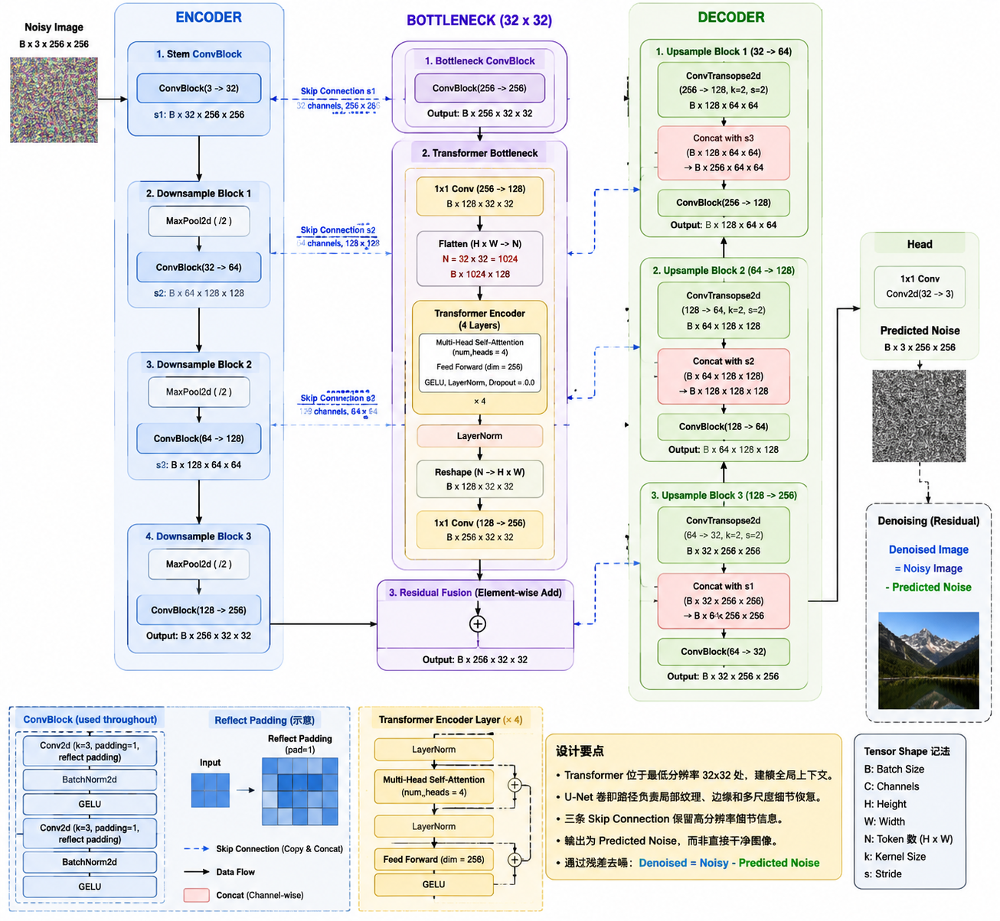

# UNet-Transformer 图像去噪项目综合说明与模型分析

## 第一部分：模型分析

### 1. 项目任务与整体思路

本项目实现的是一个面向图像去噪任务的 `UNet + Transformer` 混合模型。  
模型输入带噪图像，输出预测噪声，再通过：

```python
denoised = noisy - pred_noise
```

恢复出干净图像。

与“直接预测去噪图像”相比，这种“预测噪声”的方式通常更容易训练，也更符合很多图像恢复任务的经典建模思路。

当前项目已经完成了完整的训练、测试与推理流程，并针对小噪声、中等噪声、大噪声三种场景分别进行了实验。

### 2. 模型结构分析



#### 2.1 主体结构

模型定义在 [src/ut_project/models/unet_transformer.py](/d:/python%20code/unet_transformer_project/src/ut_project/models/unet_transformer.py) 中，整体结构是一个三层下采样的 UNet：

- `stem`：初始卷积特征提取
- `down1/down2/down3`：逐步下采样并增加通道数
- `up1/up2/up3`：逐步上采样并与编码器特征进行跳跃连接融合
- `head`：输出预测噪声

UNet 的作用主要是：

- 提取多尺度特征
- 保留局部纹理与边缘
- 在恢复过程中利用跳跃连接减少细节损失

这对图像去噪非常重要，因为去噪任务不仅要去掉噪声，还要尽量保留真实结构。

#### 2.2 Transformer 瓶颈设计

模型在最深层加入了 `TransformerBottleneck`，定义在 [src/ut_project/models/blocks.py](/d:/python%20code/unet_transformer_project/src/ut_project/models/blocks.py)。

其流程是：

1. 用 `1x1 Conv` 将卷积特征投影到 `embed_dim`
2. 将二维特征图拉平成 token 序列
3. 送入多层 `TransformerEncoder`
4. 再恢复成二维特征图
5. 通过残差方式与卷积瓶颈输出融合

这样做可以使得：

- 卷积负责局部细节建模
- Transformer 负责全局上下文建模
- 两者互补，增强对大图结构与长距离依赖的感知能力

当前默认配置为：

- `patch_size = 256`
- `transformer_layers = 4`
- `embed_dim = 128`
- `num_heads = 4`
- `ff_dim = 256`

对于 `patch_size=256` 的训练块，经过三次下采样后，瓶颈特征图约为 `32 x 32`，也就是大约 `1024` 个 token。这个规模已经可以让 Transformer 看到较丰富的上下文，但同时也意味着比更小 patch 有更高的计算开销。

### 3. 训练与评估机制分析

训练逻辑定义在 [src/ut_project/engine/trainer.py](/d:/python%20code/unet_transformer_project/src/ut_project/engine/trainer.py) 中。

#### 3.1 数据输入

训练集与测试集都由 [src/ut_project/data/dataset.py](/d:/python%20code/unet_transformer_project/src/ut_project/data/dataset.py) 读取：

- 训练集：从 `train/` 中读取图像，并随机裁剪 patch
- 测试集：从 `test/` 中读取整张图像，不做随机裁剪

这意味着：

- 训练时模型学习的是局部块上的去噪规律
- 测试和推理时则是在整图尺度上验证泛化效果

#### 3.2 动态加噪

训练时并不是直接读取“噪声图-干净图”对，而是：

1. 先读入干净图像
2. 按设定噪声范围随机采样噪声标准差
3. 在线加入高斯噪声
4. 让模型预测实际噪声

这种做可以使：

- 数据利用更灵活
- 同一张图可以在不同轮次遇到不同噪声强度
- 更适合做多档噪声实验

#### 3.3 损失函数与指标

当前训练目标是最小化：

- `MSELoss(pred_noise, target_noise)`

当前评估指标主要是：

- `avg_loss`
- `avg_psnr`

其中 PSNR 越高，说明重建结果越接近原图。

### 4. 实验结果分析

实验结果记录在 [src/ut_project/result.txt](/d:/python%20code/unet_transformer_project/src/ut_project/result.txt) 中。根据结果，可以得到以下结论。

#### 4.1 小噪声模型

训练阶段：

- `avg_loss` 从 `0.005711` 降到 `0.000431`
- `avg_psnr` 在 `32.72 dB` 到 `35.36 dB` 之间波动
- 第 `10` 个 epoch 达到最高平均 PSNR `35.36 dB`

随机测试样本：

- `0806.png`：噪声标准差 `0.048`，PSNR `30.23 dB`
- `0816.png`：噪声标准差 `0.027`，PSNR `35.63 dB`
- `0898.png`：噪声标准差 `0.006`，PSNR `41.62 dB`

分析：

- 小噪声场景下模型表现最好
- 当噪声很弱时，模型恢复效果明显，PSNR 可以超过 `40 dB`
- 当噪声接近小噪声档位上界时，PSNR 下降明显，但整体仍较高

结论：

- 模型对轻度噪声有很强恢复能力
- 当前结构已经能够较好完成小噪声图像去噪任务

#### 4.2 中等噪声模型

训练阶段：

- `avg_loss` 从 `0.011830` 降到 `0.001636`
- `avg_psnr` 从 `24.16 dB` 提升到 `28.97 dB`

随机测试样本：

- `0866.png`：噪声标准差 `0.061`，PSNR `30.44 dB`
- `0824.png`：噪声标准差 `0.109`，PSNR `28.15 dB`
- `0818.png`：噪声标准差 `0.145`，PSNR `26.15 dB`

分析：

- 模型在中噪声下仍然稳定收敛
- 噪声越高，PSNR 越低，说明中高范围内细节恢复开始变难
- 对中等噪声的整体恢复质量是“可用且稳定”的

结论：

- 中噪声去噪能力较好
- 相比小噪声，图像细节保留和纹理恢复能力已经出现明显衰减

#### 4.3 大噪声模型

训练阶段：

- `avg_loss` 从 `0.018928` 降到 `0.003881`
- `avg_psnr` 从 `21.75 dB` 上升到最高 `25.14 dB`

随机测试样本：

- `0857.png`：噪声标准差 `0.264`，PSNR `25.66 dB`
- `0895.png`：噪声标准差 `0.282`，PSNR `21.09 dB`
- `0858.png`：噪声标准差 `0.265`，PSNR `24.78 dB`

分析：

- 模型在大噪声场景下仍然有一定恢复能力
- 但 PSNR 下降显著，说明强噪声已经严重破坏图像信息
- 当噪声强度进一步升高时，视觉质量会明显下降

结论：

- 当前模型在大噪声场景下可用，但性能不够强
- 如果后续应用目标偏向重噪声图像，模型还需要进一步增强

### 5. 综合性能评价

#### 5.1 模型优点

- 结构清晰，易于理解和扩展
- UNet 与 Transformer 组合合理，局部与全局信息兼顾
- 小噪声场景表现优秀
- 中噪声场景表现稳定
- 大噪声场景仍保留基础恢复能力

#### 5.2 当前局限

- 强噪声下性能下降明显
- 训练后期 `avg_psnr` 存在波动
- 当前 best model 是按训练 loss 保存，不是按验证 PSNR 保存
- 测试阶段的噪声是随机生成的，因此不同 epoch 的 `avg_psnr` 有一定随机性

### 6. 可改进方向

结合当前结果，建议后续优化按以下优先级推进。

#### 6.1 优先改进评估与保存策略

建议：

- 固定测试噪声或验证噪声
- 使用验证集固定样本做评估
- 按 `avg_psnr` 或验证集性能保存 `best_model`

这样做使得：

- 曲线更稳定
- best model 更可靠
- 不同实验更容易公平比较

#### 6.2 增加训练轮数并引入学习率调度

当前只训练了 `12` 个 epoch，对 Transformer 参与的图像恢复模型来说偏少。建议：

- 将训练轮数提升到 `20-50`
- 加入学习率调度器

这有助于：

- 提升中后期收敛质量
- 降低后期波动
- 提升中高噪声场景表现

#### 6.3 优化数据采样策略

当前训练时每张图只随机裁一个 patch，可能导致：

- 大图区域覆盖不足
- 某些结构长期没有被充分训练

建议尝试：

- 每张图每轮采多个 patch
- 设计更系统的 patch 覆盖策略
- 适当增加总训练步数

#### 6.4 尝试更丰富的损失函数

当前仅使用 `MSELoss`。后续可尝试：

- `L1`
- `MSE + L1`
- 感知损失
- SSIM / MS-SSIM 相关损失

这些方法可能在：

- 保留纹理
- 防止过度平滑
- 提升主观视觉效果

方面带来更好的结果。

#### 6.5 针对大噪声增强模型能力

如果后续重点是大噪声场景，可以考虑：

- 增大 `embed_dim`
- 增大 `ff_dim`
- 提高 `base_channels`
- 继续增加 Transformer 层数

不过应注意：

- 显存与训练时间都会显著增加
- 目前数据量只有约 800 张，模型过大可能导致过拟合

因此更稳妥的顺序是：  
先稳定评估与训练策略，再考虑继续放大模型。

### 7. 模型分析结论

当前这个 `UNet + Transformer` 去噪模型已经具备良好的基础性能：

- 小噪声场景效果优秀
- 中噪声场景结果稳定
- 大噪声场景仍可用，但性能下降明显


---

## 第二部分：README

### 1. 项目简介

这是一个基于 `UNet + Transformer` 的图像去噪项目。

项目特点：

- 使用 UNet 进行多尺度特征提取与重建
- 在瓶颈层加入 Transformer 进行全局上下文建模
- 支持小、中、大、自定义噪声强度训练
- 支持随机测试集抽样推理与单张图像推理
- 支持按噪声档位分目录保存模型

### 2. 项目结构

```text
unet_transformer_project
├─ README.md
├─ requirements.txt
├─ train.py
├─ infer.py
└─ src
   └─ ut_project
      ├─ __init__.py
      ├─ config.py
      ├─ result.txt
      ├─ 模型分析.md
      ├─ data
      │  ├─ __init__.py
      │  └─ dataset.py
      ├─ engine
      │  ├─ __init__.py
      │  └─ trainer.py
      └─ models
         ├─ __init__.py
         ├─ blocks.py
         └─ unet_transformer.py
```

### 3. 依赖安装

在项目根目录执行：

```bash
pip install -r requirements.txt
```

当前依赖主要包括：

- `torch`
- `torchvision`
- `matplotlib`
- `Pillow`

### 4. 数据目录要求

默认数据目录由 [src/ut_project/config.py](/d:/python%20code/unet_transformer_project/src/ut_project/config.py) 中的 `DEFAULT_DATA_ROOT` 指定。目录结构要求如下：

```text
data_root/
├─ train/
└─ test/
```

其中：

- `train/` 放训练图像
- `test/` 放测试图像

如果不想使用默认路径，可以在命令行中通过 `--data-root` 指定。

### 5. 默认训练配置

当前默认配置为：

- `patch_size = 256`
- `batch_size = 8`
- `epochs = 12`
- `base_channels = 32`
- `embed_dim = 128`
- `num_heads = 4`
- `transformer_layers = 4`
- `ff_dim = 256`
- `dropout = 0.0`

训练设备当前为强制 GPU：

```python
device = torch.device("cuda")
```

因此训练和推理前需要先激活包含 CUDA 版 PyTorch 的环境。

### 6. 训练方法

#### 6.1 基础训练

```bash
python train.py
```

#### 6.2 选择噪声强度训练

- 小噪声训练：

```bash
python train.py --noise-level small
```

- 中噪声训练：

```bash
python train.py --noise-level medium
```

- 大噪声训练：

```bash
python train.py --noise-level large
```

- 自定义噪声范围训练：

```bash
python train.py --noise-level custom --noise-min 0.02 --noise-max 0.08
```

#### 6.3 常用自定义训练参数

```bash
python train.py --noise-level custom --noise-min 0.02 --noise-max 0.08 --epochs 20 --batch-size 8 --patch-size 256 --transformer-layers 4
```

### 7. 模型保存方式

当前模型会按噪声模式自动保存到不同目录：

- `checkpoints/small/`
- `checkpoints/medium/`
- `checkpoints/large/`
- `checkpoints/custom/`

每个目录下会保存：

- `unet_transformer_latest.pth`
- `unet_transformer_best.pth`

如果手动指定 `--checkpoint-dir`，则会优先保存到你指定的目录。

### 8. 推理与测试方法

#### 8.1 随机从测试集抽取 3 张图测试

```bash
python infer.py --checkpoint checkpoints/small/unet_transformer_best.pth --noise-level small
```

也可以测试其他噪声强度：

```bash
python infer.py --checkpoint checkpoints/medium/unet_transformer_best.pth --noise-level medium
python infer.py --checkpoint checkpoints/large/unet_transformer_best.pth --noise-level large
python infer.py --checkpoint checkpoints/custom/unet_transformer_best.pth --noise-level custom --noise-min 0.08 --noise-max 0.12
```

这个模式下会：

- 从测试集随机选 3 张图
- 按指定噪声范围给测试图加噪
- 在第一页显示图片结果
- 在第二页显示指标表格，包括文件名、尺寸、噪声标准差和 PSNR

#### 8.2 对指定单张图像推理

```bash
python infer.py --checkpoint checkpoints/small/unet_transformer_best.pth --input "D:\test\image.png"
```

如果要保存结果：

```bash
python infer.py --checkpoint checkpoints/small/unet_transformer_best.pth --input "D:\test\image.png" --output "D:\output\denoised.png"
```

注意：

- 单张图像推理模式下不会额外人为加噪
- `--output` 只对单张图像模式有效

### 9. 当前代码实现特点

- 训练时按噪声档位动态加噪
- 测试时支持随机三图评估
- 测试指标包括 `PSNR` 与 `Noise Std`
- 训练日志输出每个 epoch 的 `avg_loss` 与 `avg_psnr`
- 模型结构默认使用 `patch_size=256` 与 `4` 层 Transformer

### 10. 使用建议

推荐流程如下：

1. 激活带 CUDA 的 conda 环境
2. 安装依赖
3. 先运行小噪声训练
4. 再运行中噪声和大噪声训练
5. 使用对应 checkpoint 做随机测试
6. 比较不同噪声档位的 PSNR 表现

推荐命令示例：

```bash
python train.py --noise-level small
python train.py --noise-level medium
python train.py --noise-level large

python infer.py --checkpoint checkpoints/small/unet_transformer_best.pth --noise-level small
python infer.py --checkpoint checkpoints/medium/unet_transformer_best.pth --noise-level medium
python infer.py --checkpoint checkpoints/large/unet_transformer_best.pth --noise-level large
```
